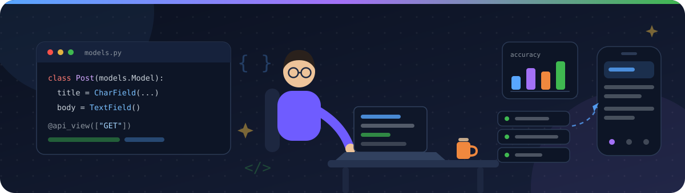
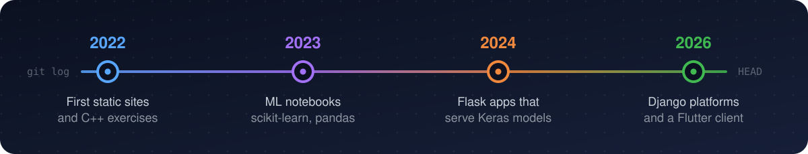

# Anuj Kumar Kushwaha

**I build the server, the app that talks to it, and the deploy that keeps it up.**

Python and Django on the backend, Flutter on the phone, Postgres underneath.
Whole applications, in public, with tests — not snippets.

---

## About

Most of what lives here is a complete application rather than an exercise. The current
one, **Marginalia**, is a writing platform in two halves — a Flutter client and a Django
REST API on Postgres — deployed, documented with Swagger, and covered by 109 API tests
and 35 widget tests. Before it, **HireHorizon** began as a Flask blog and was rewritten
as five Django apps carrying feeds, follows, messaging and notifications.

The other half of the account is applied ML: Keras CNNs that ended up behind Flask forms
instead of stopping at the notebook, plus scikit-learn work on sonar, spam and diabetes
datasets. I gravitate to the unglamorous parts — sending mail when the host blocks SMTP,
picking the right Postgres pooler mode, giving a diff tool a parser you can extend.

---

## Tech Stack

Only what the repositories here actually run on.

| | |
|:--|:--|
| **Languages** |      |
| **Backend** |     |
| **Mobile** |    |
| **AI / ML** |      |
| **Data** |    |
| **Shipping** |     |

---

## Featured Projects

<table>
<tr>
<td width="50%" valign="top">

### [Marginalia](https://github.com/PRiNCeKUsHW/marginalia)

A publishing app in two halves: a Flutter client and a Django REST backend. Essays with
categories and full-text search, `@handles`, following and a Following feed, comments,
in-app notifications, and an author dashboard showing views, likes and comments with
week-over-week change.

**Tech** · Flutter · Riverpod · Hive · Django 6 · DRF · SimpleJWT · PostgreSQL (Supabase) · Render

**Why it's interesting** — one product, two codebases, shipped end to end: signup by
one-time code sent over an HTTP mail API because the host blocks SMTP, pooler-aware
database settings, and 144 tests between the API and the app.

[Live API docs](https://marginalia-hp35.onrender.com/api/docs/) · free tier, so give it a minute to wake

</td>
<td width="50%" valign="top">

### [HireHorizon](https://github.com/PRiNCeKUsHW/HireHorizon)

A text-first social publishing platform built as five Django apps — long-form posts,
feed, follow, like, comment with replies, repost, bookmark, `@mentions`, private
messaging, notifications, and a trending Explore page based on 7-day engagement.

**Tech** · Django 5 · PostgreSQL / SQLite · WhiteNoise · Gunicorn · Cloudflare Tunnel

**Why it's interesting** — it accepts no image uploads anywhere, on purpose, which
removes a whole class of moderation and security work; and it can self-host from an
Android phone under Termux, public over a Cloudflare quick tunnel.

</td>
</tr>
<tr>
<td width="50%" valign="top">

### [Covid-19 Detection from X-Rays](https://github.com/PRiNCeKUsHW/covid19-detection-using-x-ray-image)

A convolutional network trained on chest X-ray images in a notebook, exported to
`covid.h5`, then put behind a Flask form: upload a scan with the patient's details, the
image is resized and normalised with OpenCV, and the prediction comes back on screen.

**Tech** · TensorFlow / Keras · OpenCV · Flask · WTForms

**Why it's interesting** — the model does not stop at the notebook; it ends up as
something a person can actually use.

</td>
<td width="50%" valign="top">

### [File Diff Engine](https://github.com/PRiNCeKUsHW/file-compare)

A Django tool for comparing two data files. Upload a baseline and a current JSON, YAML or
XML file and get every new, removed and modified entry as a filterable table plus a
downloadable CSV report.

**Tech** · Django · PyYAML · Gunicorn · WhiteNoise

**Why it's interesting** — parsers live in a registry, so supporting a new format is one
function and one dictionary entry, which is exactly how an internal tool should age.

</td>
</tr>
<tr>
<td width="50%" valign="top">

### [Dog Image Classifier](https://github.com/PRiNCeKUsHW/Dog_and_classification)

An image classifier trained with Keras `ImageDataGenerator`, saved as
`classification.h5` and wrapped in a small Flask app that serves predictions from an
upload.

**Tech** · TensorFlow / Keras · Flask

**Why it's interesting** — the same train-then-serve loop repeated on a different
dataset, which is how the habit stuck.

</td>
<td width="50%" valign="top">

### [Flask Blog](https://github.com/PRiNCeKUsHW/Flask-blog)

A multi-user blog: registration and login with hashed passwords, rich-text post editing
through CKEditor, threaded comments, Gravatar avatars, SQLAlchemy models and a Procfile
for deployment.

**Tech** · Flask · SQLAlchemy · Flask-Login · Flask-WTF · CKEditor

**Why it's interesting** — this is the app HireHorizon grew out of; the Django rewrite
still ships an `import_legacy` command that carries this database across.

</td>
</tr>
</table>

Smaller experiments live alongside these: [classic ML notebooks](https://github.com/PRiNCeKUsHW/data-science-and-ml)
(gradient descent, linear and logistic regression), [spam mail detection](https://github.com/PRiNCeKUsHW/Spam-mail-prediction),
[sonar rock vs. mine](https://github.com/PRiNCeKUsHW/Rock-and-mine), [diabetes prediction with an SVM](https://github.com/PRiNCeKUsHW/Diabetics-svm-ML)
and a [Flipkart scraping notebook](https://github.com/PRiNCeKUsHW/flipkart-scrap).

---

## Developer Journey

Static pages and C++ assignments came first, then a year of notebooks, then Flask apps
that served the models those notebooks produced, and now Django platforms with a Flutter
front end. The early repositories are still here — the record is not tidied up.

---

## Activity

---

## Currently Building

- **Marginalia** — this month's commits are on the author dashboard and view counting, merged through pull requests on the repo.
- **HireHorizon** — trimming the desktop interface down now that the Django rewrite has settled.
- **Dart and Flutter** — the newest language in this account, and where the next few builds are heading.

---

## Have an interesting idea? Let's build it.

Backend, mobile client, or the deploy in between — I'm reachable here.

Every project above is public — clone it and run it; the commands are in each README.

