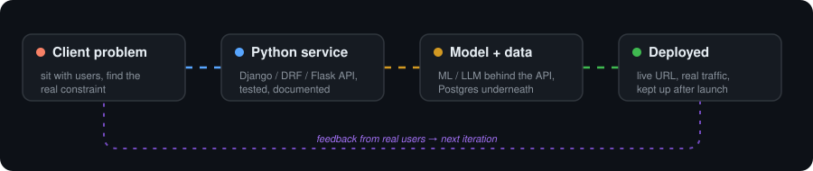
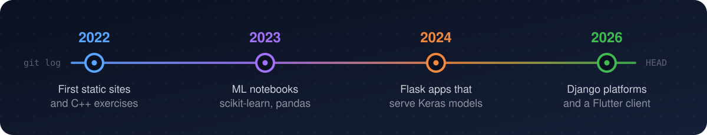

<div align="center">


<a href="https://github.com/PRiNCeKUsHW"></a>

<a href="https://github.com/PRiNCeKUsHW/marginalia"></a>
<a href="https://www.linkedin.com/in/anuj-kushwaha-76b659210/"></a>
<a href="mailto:anuj.kush03@gmail.com"></a>
<a href="https://portfolio-site-bk5i.onrender.com/"></a>


</div>

---

##  About

```python
class Anuj:
    role       = "Python Engineer → AI Engineer / Forward Deployed Engineer"
    day_job    = "GIS Analyst @ TCS — satellite imagery & LiDAR for autonomous-vehicle maps"
    education  = "B.Tech IT, MMMUT Gorakhpur (2024)"
    builds     = ["Django REST APIs", "Flutter clients", "ML models behind real UIs"]
    habit      = "ship it, test it, deploy it — then fix what real users hit"
    exploring  = ["LLM apps", "RAG", "AI agents", "FastAPI"]

    def ask_me_about(self):
        return ["DRF + JWT auth", "Postgres pooler gotchas", "taking a model out of the notebook"]
```

Most of what lives here is a **complete application rather than an exercise**. **Marginalia** is a
writing platform in two halves — a Flutter client and a Django REST API on Postgres — deployed,
documented with Swagger, and covered by **109 API tests + 35 widget tests**. **HireHorizon** began as
a Flask blog and was rewritten as five Django apps carrying feeds, follows, messaging and notifications.

The other half is applied ML: Keras CNNs that ended up **behind Flask forms instead of stopping at the
notebook**, plus scikit-learn work on sonar, spam and diabetes data. By day I work on geospatial data
pipelines — satellite imagery and LiDAR feeding HD maps for autonomous vehicles.

---

## How I work — the forward-deployed loop

<div align="center">

</div>

I gravitate to the unglamorous parts that decide whether a thing works *in the field*:

- 📮 **Host blocks SMTP?** Marginalia sends sign-up codes over an HTTP mail API instead.
- 🐘 **Free-tier Postgres dropping connections?** Pooler-aware DB settings, picked on purpose.
- 📱 **No server budget?** HireHorizon self-hosts from an Android phone under Termux behind a Cloudflare tunnel.
- 🧩 **New file format next month?** File Diff Engine keeps parsers in a registry — one function, one dict entry.

---

## Tech Stack

<div align="center">

<br>
<br>


</div>

| | |
|:--|:--|
| **Languages** |      |
| **Backend / APIs** |      |
| **AI / ML** |      |
| **Geospatial (day job)** |    |
| **Mobile** |    |
| **Data & Shipping** |      |
| **Learning now** |     |

---

## Featured Projects

<table>
<tr>
<td width="50%" valign="top">

### 📝 [Marginalia](https://github.com/PRiNCeKUsHW/marginalia)

A publishing app in two halves: a Flutter client and a Django REST backend. Essays with
categories and full-text search, `@handles`, a Following feed, comments, in-app
notifications, and an author dashboard with week-over-week views, likes and comments.

**Tech** · Flutter · Riverpod · Django 6 · DRF · SimpleJWT · PostgreSQL (Supabase) · Render

**FDE angle** — shipped end to end under real host limits: OTP over an HTTP mail API
because SMTP is blocked, pooler-aware DB settings, **144 tests** across API and app.

[](https://marginalia-hp35.onrender.com/api/docs/) <sub>free tier — give it a minute to wake</sub>

</td>
<td width="50%" valign="top">

### 🌐 [HireHorizon](https://github.com/PRiNCeKUsHW/HireHorizon)

A text-first social platform built as five Django apps — posts, feed, follow, like,
threaded comments, repost, bookmark, `@mentions`, DMs, notifications, and a trending
Explore page based on 7-day engagement.

**Tech** · Django 5 · PostgreSQL / SQLite · WhiteNoise · Gunicorn · Cloudflare Tunnel

**FDE angle** — no image uploads by design (a whole class of moderation & security work
removed), and it self-hosts from an Android phone under Termux.

</td>
</tr>
<tr>
<td width="50%" valign="top">

### 🩻 [Covid-19 Detection from X-Rays](https://github.com/PRiNCeKUsHW/covid19-detection-using-x-ray-image)

A CNN trained on chest X-rays, exported to `covid.h5`, then served behind a Flask form:
upload a scan, OpenCV resizes and normalises it, the prediction comes back on screen.

**Tech** · TensorFlow / Keras · OpenCV · Flask · WTForms

**AI angle** — the model doesn't stop at the notebook; it becomes something a person can use.

</td>
<td width="50%" valign="top">

### 🔍 [File Diff Engine](https://github.com/PRiNCeKUsHW/file-compare)

Upload a baseline and a current JSON, YAML or XML file and get every new, removed and
modified entry as a filterable table plus a downloadable CSV report.

**Tech** · Django · PyYAML · Gunicorn · WhiteNoise

**FDE angle** — parsers live in a registry, so a new format is one function and one dict
entry — exactly how an internal tool for a client should age.

</td>
</tr>
<tr>
<td width="50%" valign="top">

### 🐶 [Dog Image Classifier](https://github.com/PRiNCeKUsHW/Dog_and_classification)

Trained with Keras `ImageDataGenerator`, saved as `classification.h5` and wrapped in a
small Flask app that serves predictions from an upload.

**Tech** · TensorFlow / Keras · Flask

</td>
<td width="50%" valign="top">

### ✍️ [Flask Blog](https://github.com/PRiNCeKUsHW/Flask-blog)

Multi-user blog with hashed-password auth, CKEditor posts, threaded comments and
SQLAlchemy models — the app HireHorizon grew out of (its `import_legacy` command still
migrates this database).

**Tech** · Flask · SQLAlchemy · Flask-Login · Flask-WTF

</td>
</tr>
</table>

<sub>Smaller experiments: [classic ML notebooks](https://github.com/PRiNCeKUsHW/data-science-and-ml) ·
[spam mail detection](https://github.com/PRiNCeKUsHW/Spam-mail-prediction) ·
[sonar rock vs. mine](https://github.com/PRiNCeKUsHW/Rock-and-mine) ·
[diabetes prediction (SVM)](https://github.com/PRiNCeKUsHW/Diabetics-svm-ML) ·
[Flipkart scraping](https://github.com/PRiNCeKUsHW/flipkart-scrap)</sub>

---

## Developer Journey

<div align="center">

</div>

Static pages and C++ first, then a year of notebooks, then Flask apps serving those models,
then Django platforms with a Flutter front end — and now **LLM-powered services**. The early
repositories are still here; the record is not tidied up.

---

## GitHub Activity

<div align="center">


<picture>
  <source media="(prefers-color-scheme: dark)" srcset="https://raw.githubusercontent.com/PRiNCeKUsHW/PRiNCeKUsHW/output/github-snake-dark.svg">
  
</picture>

</div>

---

## 🚧 Currently Building

- **Marginalia** — author dashboard and view counting, merged through pull requests.
- **AI Code Review & PR Assistant** — a GitHub App that reviews pull requests with an LLM *(next build)*.
- **Dart & Flutter** — the newest language here, and where the next few clients are heading.

---

<div align="center">

### Have a messy problem that needs a working system? Let's build it.

Backend, model, mobile client, or the deploy in between — I'm reachable here.

<a href="https://www.linkedin.com/in/anuj-kushwaha-76b659210/"></a>
<a href="mailto:anuj.kush03@gmail.com"></a>
<a href="https://portfolio-site-bk5i.onrender.com/"></a>
<a href="https://github.com/PRiNCeKUsHW?tab=repositories"></a>


</div>
